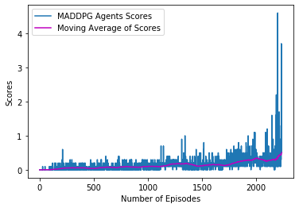

## Project 2 Report - Collaboration & Competition

### Overview

This projects trains two (2) agents how to play Tennis. In the environment, two agents control rackets to bounce a ball over a net. If an agent hits the ball over the net, it receives a reward of +0.1 while if an agent lets a ball hit the ground or hits the ball out of bounds, it receives a reward of -0.01. Thus, the goal of each agent is to keep the ball in play.

The observation space consists of 8 variables corresponding to the position and velocity of the ball and racket. Each agent receives its own, local observation.  Two continuous actions are available, corresponding to movement toward (or away from) the net, and jumping. 

The task is episodic, and in order to solve the environment, the agents must get an average score of +0.5 (over 100 consecutive episodes, after taking the maximum over both agents). After each episode, the rewards that each agent received are added (without discounting), to get a score for each agent. This yields 2 (potentially different) scores. We then take the maximum of these 2 scores which yields a single **score** for each episode.

The goal was for the agents to solve the environment and achive an average score of of +0.05 over 100 consecutive episodes.

### Learning Algorithm

Multi-Agent Deep Derterministic Policy Gradient (MADDPG) was the algorithm used to solve this environment. It was a modified version adopted from the Udacity Pendulum exercise where the DDPG function was modified for training two (2) seperate agents. 

MADDPG learning algorithm allows each agent to learn directly from the un-processed observation spaces without knowing the domain dynamic information. The general concept of this algorithm is to use policy and value based methods with Actor - Critic methods. 

The MADDPG function leverages on the DDPG funciton but this time for two (2) seperate agents and uses the policy based approach to find the optimal policy and maximize reward using gradient descent (Actor) while the value based approach estimates the value for future rewards (Critic). 

Important to note here is that with MADDPG, each agents critic is trained using the observations and states from both agents while the agents actors are trained with their seperate observations.

The environment was solved by the agents getting an average score of 0.503 above the target score of 0.5 in 2235 episodes.

The network architecture model had two Deep Neural Networks (DNN) one for the Actor and the other for the Critic. The both had three (3) linear layers with RELU as the activation function for each layer in the model.py file between the input state size and output actions size.

A great challenge was having to run the model over 10 times before it finallyc converged. I tweaked the hyperparameters several times to no success. But i also realized that with the same model and hyperparameters, each training cycle yields entierly different results.

##### The Learning algorithm for MADDPG uses the following:
* ***Actor-Critic DNN method*** where the actor agent lerans how to estimate the optimal policy and the critic agent learns how to estimate the value of different state-action pairs.
* ***Gradient Clipping*** apply gradient clipping after the backward pass to prevent exploding grdients when training the critic network.
* ***Learn Interval and Update at Timesteps*** to allow the actor and critic agent to learn at intervals of 5 timesteps and improve the agents performance.
* ***Experience replay*** to train through mini-batches from the replay buffer by sampling experiences uniformly at random from the replay memory and gather experiences from each agent.

The hyperparameters used to train the MADDPG Agent were:
* BUFFER_SIZE = int(1e6)  
* BATCH_SIZE = 256        
* LR_ACTOR = 1e-3         
* LR_CRITIC = 1e-3        
* WEIGHT_DECAY = 0        
* LEARN_EVERY = 1         
* LEARN_NUM = 5           
* GAMMA = 0.99            
* TAU = 2e-2              
* OU_SIGMA = 0.2          
* OU_THETA = 0.15         
* EPS_START = 5.0         
* EPS_EP_END = 300        
* EPS_FINAL = 0           

### Trained MADDPG Results

The figure below shows the trained two (2) MADDPG Tennis Agent results with a moving average score. 
* The MADDPG Agent average score was 0.503 in 2235 episodes.

### Ideas For Future Network

This project has utilized the Multi-Agent Deep Derterministic Policy Gradient (MADDPG). For further and future work, I plant to try out other algorithms to see how they perform in comparison to MADDPG:
1. ***Proximal Policy Optimization (PPO)***
2. ***Distributional Deterministic Policy Gradients (D4PG)***
3. ***Add Prioritized Experience Replay to DDPG*** 